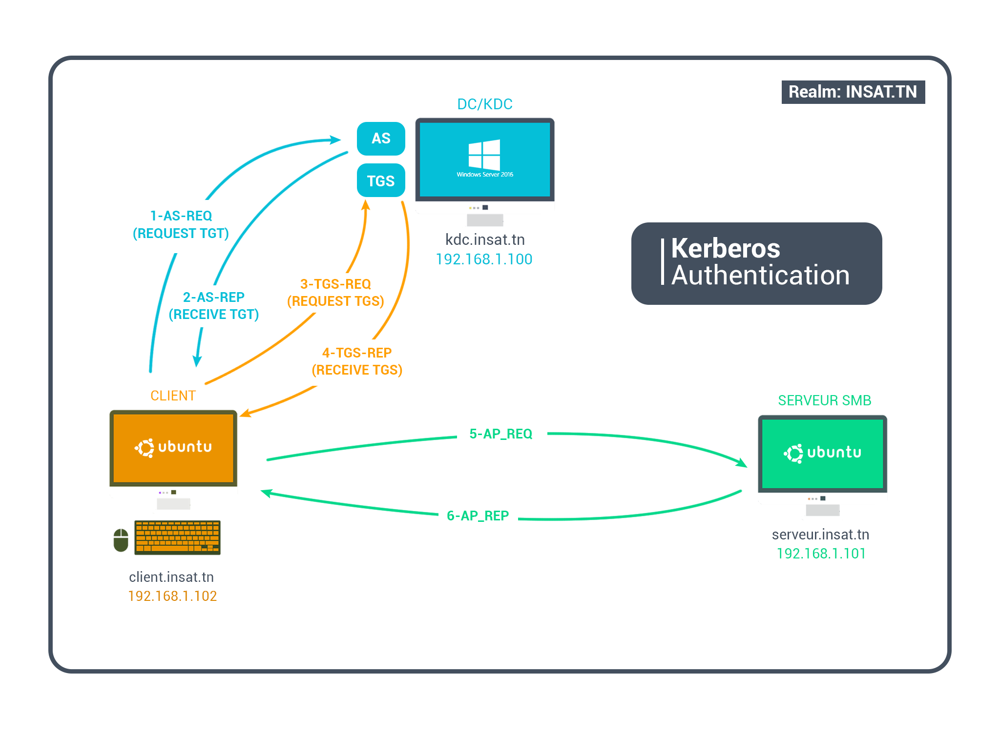

# Kerberized SMB access
Implementing and configuring Kerberos-based SMB access.

* Client: this can be any machine requesting access to any service over the network.In our case , its the Ubuntu Linux machine.
* Key Distribution Center (KDC) which handle the Kerberos authentication requests, in our case it’s the domain controller and consists of 2 components:
   - Authentication server (AS) which receives the client’s authentication requests
   - Ticket Granting Service (TGS), which issue tickets to the client to access the services he needs.
* Service: The service you need to gain access to, Both Clients and Services are considered as principals.Its the SMB server in our case.
* Realm, which is the uppercase value of the Domain name in the AD environments.

## Implementation:

You can download the detailed installation and walkthrough of the project :

[Link](Kerberos_final.pdf)
